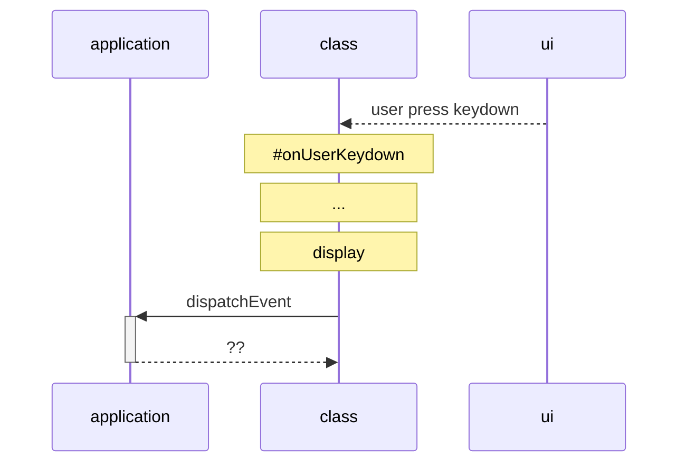

```mermaid
sequenceDiagram
    participant A as application
    participant B as class
    participant C as ui
    C-->>B: user press keydown
    Note over B: #35;onUserKeydown
    Note over B: ...
    Note over B: display
    
    B->>+A: dispatchEvent
    A-->>-B: ??
```

